# N E X U S

## Krishna Sai Channalli

**Computer Science Engineer** 
AI systems · agents · automation · engineering

### Engineering domains

`AI systems` · `Agent systems` · `Automation` · `Computer vision` · `Voice systems` · `Full-stack systems`

### The-Opero // Autonomous Operator Core

**[The-Opero](https://github.com/channallikrishnasai/The-Opero)** — Open Personal Execution &amp; Response Operator: a local desktop AI operator using Python, PyQt6, Gemini integration, local execution modules, dashboard, plugins, and a WhatsApp bridge.

### VaultIQ AI // Financial Intelligence

**[VaultIQ AI](https://github.com/channallikrishnasai/vaultiq-ai)** — personal-finance platform for budgeting, investing, fraud protection, goals, and scenario planning.

### LifeOS AI // Life-System Map

**[LifeOS AI](https://github.com/channallikrishnasai/LifeOS-AI)** — AI life-management platform for projects, goals, habits, learning, and startup planning.

### PRISM // Code Intelligence

**[PRISM / Entire Graph](https://github.com/channallikrishnasai/PRISM)** — local repository maps, ranked code search, and change-impact navigation for coding agents.

**[GitHub](https://github.com/channallikrishnasai)** · **[LinkedIn](https://www.linkedin.com/in/krishna-sai-channalli-4528262b3)**

