  

  

  

  

  

  

  
  

  

  

  <a href="https://github.com/channallikrishnasai">GitHub</a> ·
  <a href="https://www.linkedin.com/in/krishna-sai-channalli-4528262b3">LinkedIn</a>

  

