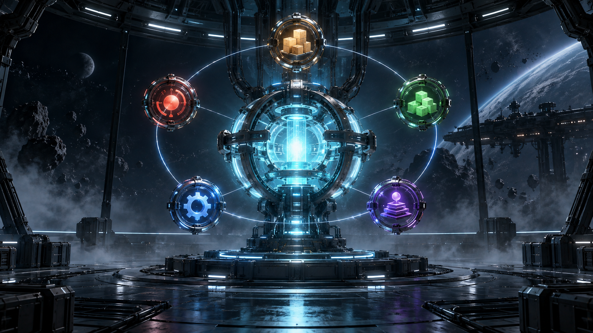

  

# Krishna Sai Channalli

**AI Systems · Agent Engineering · Automation**

Building intelligent systems that see, speak, think, and act.

 

### Now building

**[OPERO](https://github.com/channallikrishnasai/OPERO)** — an operations dashboard foundation for orders, incidents, inventory, tasks, and audit activity.

  

[Explore OPERO →](https://github.com/channallikrishnasai/OPERO)

### Selected systems

**[LifeOS AI](https://github.com/channallikrishnasai/LifeOS-AI)**  
AI-powered platform for tasks, goals, habits, notes, learning, and startup planning.  
`FastAPI` · `React` · `PostgreSQL` · `Redis`

**[Rakva](https://github.com/channallikrishnasai/Rakva)**  
AI-powered disaster intelligence and recovery planning platform.  
`Next.js` · `React` · `Three.js`

  

### Systems I build

`AI agents` · `Intelligent applications` · `Automation` · `Operations systems` · `Developer tools`

  &nbsp;&nbsp;
  &nbsp;&nbsp;
  &nbsp;&nbsp;
  &nbsp;&nbsp;
  &nbsp;&nbsp;
  &nbsp;&nbsp;
  &nbsp;&nbsp;
  

 

  
  

  

  

**[GitHub](https://github.com/channallikrishnasai)** · **[LinkedIn](https://www.linkedin.com/in/krishna-sai-channalli-4528262b3)**

