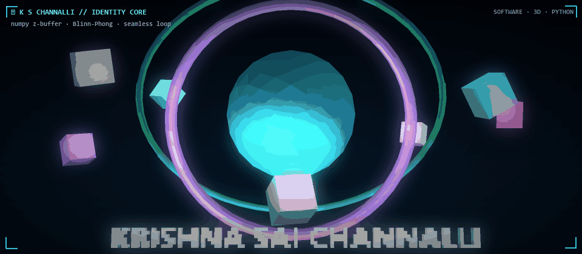
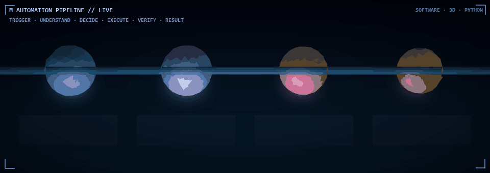

  

# Krishna Sai Channalli

**Computer Science Engineer** — intelligent systems across AI, agents, vision, voice, automation & full-stack engineering.

---

## 01 / Technology Stack

> Every tool I actually ship with — grouped, badged, complete.

<table>
<tr><th>Domain</th><th>Stack</th></tr>
<tr>
<td><strong>🐍 Languages</strong></td>
<td>
<code>Python</code> <code>TypeScript</code> <code>JavaScript</code> <code>Rust</code> <code>Go</code> <code>SQL</code> <code>HTML</code> <code>CSS</code>
</td>
</tr>
<tr>
<td><strong>🤖 AI</strong></td>
<td>
<code>Google Gemini</code> <code>OpenAI</code> <code>OpenRouter</code> <code>Groq</code> <code>AI Agents</code> <code>Agent Orchestration</code> <code>RAG</code> <code>Prompt Engineering</code>
</td>
</tr>
<tr>
<td><strong>⚛️ Frontend</strong></td>
<td>
<code>React</code> <code>Next.js</code> <code>Vite</code> <code>Tailwind CSS</code> <code>Radix UI</code> <code>Framer Motion</code> <code>TanStack Router</code> <code>TanStack Query</code> <code>Zustand</code> <code>Three.js</code> <code>React Three Fiber</code> <code>Drei</code> <code>shadcn/ui</code>
</td>
</tr>
<tr>
<td><strong>🔧 Backend</strong></td>
<td>
<code>FastAPI</code> <code>Uvicorn</code> <code>Node.js</code> <code>Next.js API Routes</code> <code>Axum</code> <code>Express</code> <code>WebSockets</code> <code>REST</code> <code>GraphQL</code>
</td>
</tr>
<tr>
<td><strong>🗄️ Data</strong></td>
<td>
<code>PostgreSQL</code> <code>SQLite</code> <code>Supabase</code> <code>Prisma</code> <code>SQLx</code> <code>Redis</code> <code>MongoDB</code> <code>Firebase</code>
</td>
</tr>
<tr>
<td><strong>⚙️ Automation</strong></td>
<td>
<code>PyQt6</code> <code>PyAutoGUI</code> <code>Browser Automation</code> <code>Selenium</code> <code>Playwright</code> <code>WebSockets</code> <code>Cron</code> <code>GitHub Actions</code>
</td>
</tr>
<tr>
<td><strong>🏗️ Infrastructure</strong></td>
<td>
<code>Docker</code> <code>Docker Compose</code> <code>S3</code> <code>OCI</code> <code>OpenTelemetry</code> <code>Tempo</code> <code>Loki</code> <code>GitHub Actions</code> <code>Linux</code> <code>Nginx</code>
</td>
</tr>
<tr>
<td><strong>🧪 Tooling</strong></td>
<td>
<code>pytest</code> <code>Ruff</code> <code>Pydantic</code> <code>Zod</code> <code>Cargo</code> <code>Clippy</code> <code>just</code> <code>cargo-watch</code> <code>Git</code> <code>VS Code</code>
</td>
</tr>
</table>

<strong>🏷️ Domain focus badges</strong>

 

---

## 02 / Projects

| Project | What it is | Stack | Links |
| :-- | :-- | :-- | :-- |
| **The-Opero** | Local desktop AI operator | `Python` `PyQt6` `Gemini` | [Repo](https://github.com/channallikrishnasai/The-Opero) |
| **VaultIQ AI** | AI-powered personal-finance platform | `Next.js` `TypeScript` `Prisma` `Tailwind` | [Repo](https://github.com/channallikrishnasai/vaultiq-ai) |
| **LifeOS AI** | AI life-management platform | `FastAPI` `React` `PostgreSQL` `Redis` `WebSockets` | [Repo](https://github.com/channallikrishnasai/LifeOS-AI) |
| **Rakva** | AI disaster intelligence & recovery planning | `TypeScript` `React` `AI` | [Repo](https://github.com/channallikrishnasai/Rakva) |
| **PRISM / Entire Graph** | Local code intelligence & change-impact navigation | `Go` `tree-sitter` `local indexing` | [Repo](https://github.com/channallikrishnasai/PRISM) |
| **lnegobuy** | Web application | `JavaScript` | [Repo](https://github.com/channallikrishnasai/lnegobuy) |

---

## 03 / Automation

  

<table>
<tr><th>System</th><th>Input</th><th>Processing</th><th>Output</th></tr>
<tr><td>🖥️ Browser automation</td><td>Command</td><td>Browser control</td><td>Verified action</td></tr>
<tr><td>📦 Repository analysis</td><td>Code</td><td>Indexing + analysis</td><td>Search / maps / navigation</td></tr>
<tr><td>💰 Financial intelligence</td><td>Financial data</td><td>AI analysis</td><td>Insight</td></tr>
<tr><td>🎙️ Voice systems</td><td>Spoken input</td><td>Speech + reasoning pipeline</td><td>Action / response</td></tr>
<tr><td>🤖 Agent workflows</td><td>Goal / prompt</td><td>Plan → tool calls → reflect</td><td>Completed task</td></tr>
</table>

---

## 04 / Engineering Approach

| Build | Experiment | Measure | Automate | Verify | Ship |
| :--: | :--: | :--: | :--: | :--: | :--: |
| 🔨 | 🔬 | 📊 | ⚙️ | ✅ | 🚀 |

**Build → Experiment → Measure → Automate → Verify → Ship**

---

## 05 / GitHub Activity

  
  
  

---

## Connect

**GitHub:** https://github.com/channallikrishnasai  
**LinkedIn:** https://www.linkedin.com/in/krishna-sai-channalli-4528262b3

