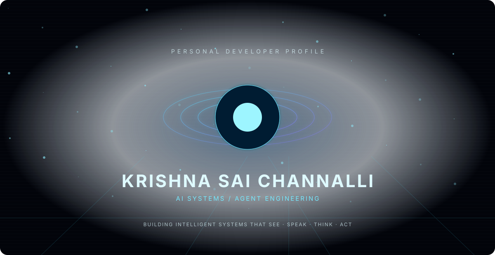
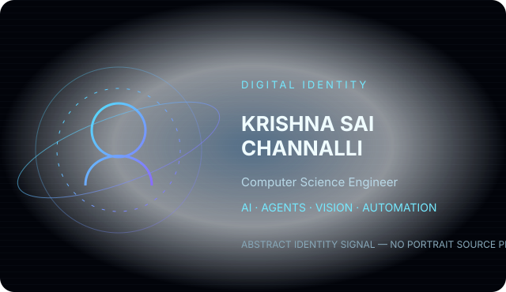
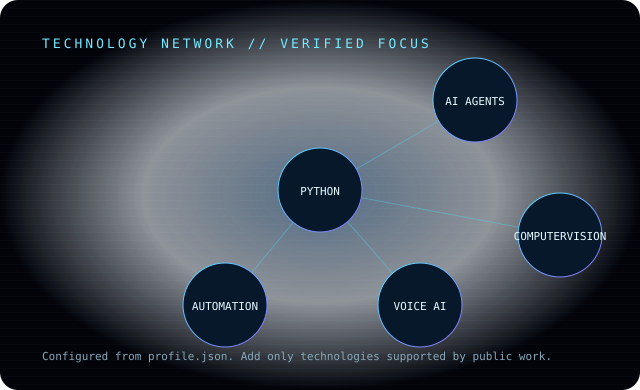
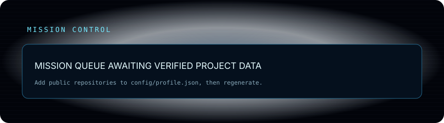
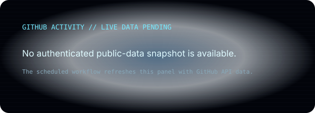
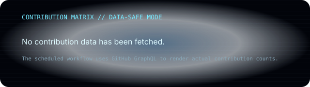
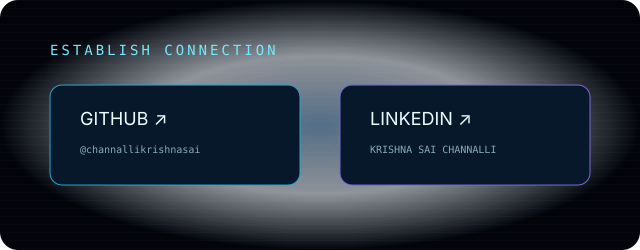

<p align="center">
  
</p>

<p align="center"><i>Building intelligent systems that see, speak, think, and act.</i></p>

<p align="center">
  
</p>

## Identity

<p align="center">
  
</p>

## Technology Network

<p align="center">
  
</p>

## Mission Control

<p align="center">
  
</p>

## GitHub Activity

<p align="center">
  
  
</p>

## Terminal

```text
KRISHNA.SAI // TERMINAL
$ whoami   → Krishna Sai Channalli
$ focus    → AI Systems / Agent Engineering
$ build    → intelligent, experimental systems
$ status   → ONLINE
```

## Engineering Philosophy

Build deliberately. Experiment against evidence. Automate repeatable work. Verify before shipping.

## Establish Connection

<p align="center">
  <a href="https://github.com/channallikrishnasai">GitHub</a> ·
  <a href="https://www.linkedin.com/in/krishna-sai-channalli-4528262b3">LinkedIn</a>
</p>

<p align="center">
  
</p>
