<p align="center">
  
</p>

<div align="center">

# Krishna Sai Channalli

Computer Science Engineer building intelligent systems across AI, agents, vision, voice, automation, and full-stack engineering.

</div>

| SYSTEM | PROFILE STATE | FOCUS | CURRENT BUILD |
| :-- | :-- | :-- | :-- |
| NEXUS | Building | AI systems · agents · automation | [The-Opero](https://github.com/channallikrishnasai/The-Opero) |

## 01 / Technology

<p align="center">
  
</p>

### Technology matrix

| Domain | Verified public-repository stack |
| :-- | :-- |
| Languages | Python · TypeScript · JavaScript · Rust · SQL · HTML · CSS |
| AI | Google Gemini · OpenAI · OpenRouter · Groq · AI agents · Agent orchestration |
| Frontend | React · Next.js · Vite · Tailwind CSS · Radix UI · Framer Motion · TanStack Router · TanStack Query · Zustand · Three.js · React Three Fiber · Drei |
| Backend | FastAPI · Uvicorn · Node.js · Next.js API Routes · Axum |
| Data | PostgreSQL · SQLite · Supabase · Prisma · SQLx · Redis |
| Automation | PyQt6 · PyAutoGUI · Browser automation · WebSockets |
| Infrastructure | Docker · Docker Compose · S3 · OCI · OpenTelemetry · Tempo · Loki · GitHub Actions |
| Tooling | pytest · Ruff · Pydantic · Zod · Cargo · Clippy · just · cargo-watch |

`AI agents` · `Intelligent applications` · `Computer vision` · `Voice systems` · `Automation` · `Developer infrastructure`

## 02 / Project systems

> **NEAR / THE-OPERO** — local desktop AI operator
>
> **MID / VAULTIQ AI · LIFEOS AI** — financial intelligence and life-management systems
>
> **FAR / PRISM** — local code intelligence and change navigation

| System | Verified purpose | Core stack | Repository |
| :-- | :-- | :-- | :-- |
| The-Opero | Open Personal Execution &amp; Response Operator; a local desktop AI operator. | Python · PyQt6 · Gemini integration | [View →](https://github.com/channallikrishnasai/The-Opero) |
| VaultIQ AI | Personal-finance platform for budgeting, investing, fraud protection, goals, and scenario planning. | Next.js 16 · TypeScript · Prisma · Tailwind CSS | [View →](https://github.com/channallikrishnasai/vaultiq-ai) |
| LifeOS AI | AI life-management platform for projects, goals, habits, learning, and startup planning. | FastAPI · React · PostgreSQL · Redis · WebSockets | [View →](https://github.com/channallikrishnasai/LifeOS-AI) |
| PRISM / Entire Graph | Coding-agent plugin for local repository maps, ranked code search, and change-impact navigation. | Go · tree-sitter · local indexing | [View →](https://github.com/channallikrishnasai/PRISM) |

## 03 / The-Opero

**Open Personal Execution &amp; Response Operator** — a local desktop AI operator with Python, PyQt6, Gemini integration, local execution modules, a dashboard, plugins, and a WhatsApp bridge.

```text
INPUT
  ↓
UNDERSTAND
  ↓
INVESTIGATE  →  DECIDE  →  ACT
                           ↓
                        VERIFY
                           ↓
                        REPORT
```

| Layer | Repository-supported role |
| :-- | :-- |
| Input | Local operator inputs and commands |
| Intelligence | Gemini integration and response processing |
| Execution | Local execution modules, plugins, and desktop operator surface |
| Communication | WhatsApp bridge included in the public project |
| Response loop | Investigate → decide → act → verify → report |

[Explore The-Opero →](https://github.com/channallikrishnasai/The-Opero)

## 04 / Systems in focus

### VaultIQ AI

Financial intelligence for budgeting, investing, fraud protection, goals, and scenario planning. Its public repository uses Next.js 16, TypeScript, Prisma, Tailwind CSS, and multiple AI providers.

### LifeOS AI

Life-management workspace spanning projects, goals, habits, learning, and startup planning, built with FastAPI, React, PostgreSQL, Redis, WebSockets, and specialized AI agents.

### PRISM / Entire Graph

Code intelligence for coding agents: tree-sitter analysis, local indexing, ranked search, repository maps, and change-impact navigation.

## 05 / Automation

```text
TRIGGER  →  UNDERSTAND  →  DECIDE  →  EXECUTE  →  VERIFY  →  RESULT
```

| System | Input | Processing | Output |
| :-- | :-- | :-- | :-- |
| Browser automation | Command | Browser control | Verified action |
| Repository analysis | Code | Indexing and analysis | Search, maps, or navigation |
| Financial intelligence | Financial data | AI analysis | Insight |

## 06 / GitHub signal

Public repositories, current activity, and contribution history remain directly available on [my GitHub profile](https://github.com/channallikrishnasai). The profile README does not duplicate or fabricate those live metrics.

## 07 / Terminal

```text
nexus@krishna:~$ system

profile     Krishna Sai Channalli
focus       AI / Agents / Automation
current     The-Opero
stack       Python / TypeScript / Rust
status      Ready

nexus@krishna:~$ _
```

## Connect

[GitHub](https://github.com/channallikrishnasai) · [LinkedIn](https://www.linkedin.com/in/krishna-sai-channalli-4528262b3)
