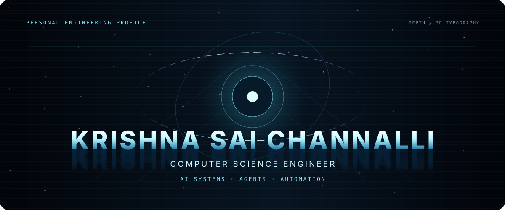
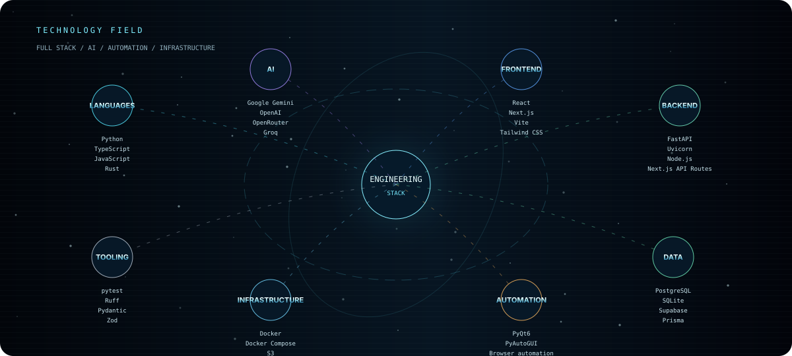
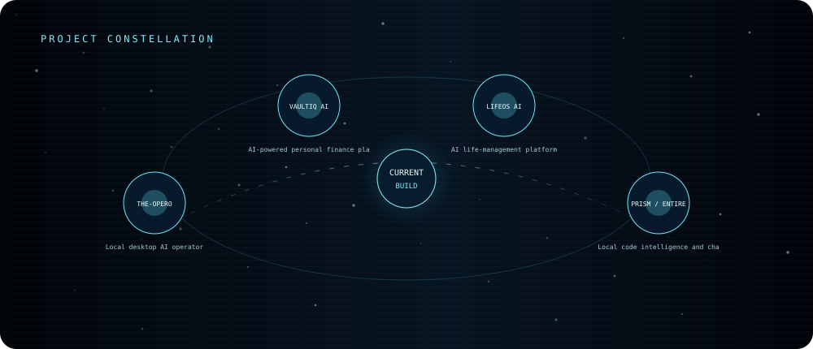
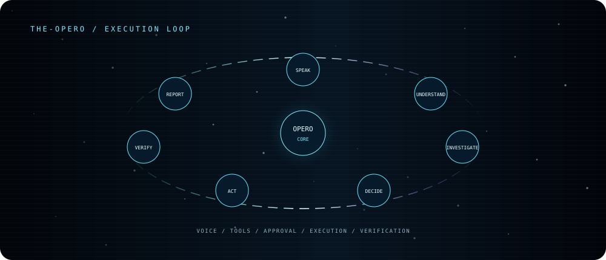

<p align="center">
  
</p>

<p align="center">
  
</p>

<div align="center">

# Krishna Sai Channalli

**Computer Science Engineer** building intelligent systems across AI, agents, vision, voice, automation, and full-stack engineering.

[GitHub](https://github.com/channallikrishnasai) · [LinkedIn](https://www.linkedin.com/in/krishna-sai-channalli-4528262b3)

</div>

---

## 01 / Technology

<p align="center">
  
</p>

### Full technology stack

| Domain | Stack |
| :-- | :-- |
| **Languages** | Python · TypeScript · JavaScript · Rust · SQL · HTML · CSS |
| **AI** | Google Gemini · OpenAI · OpenRouter · Groq · AI agents · Agent orchestration |
| **Frontend** | React · Next.js · Vite · Tailwind CSS · Radix UI · Framer Motion · TanStack Router · TanStack Query · Zustand · Three.js · React Three Fiber · Drei |
| **Backend** | FastAPI · Uvicorn · Node.js · Next.js API Routes · Axum |
| **Data** | PostgreSQL · SQLite · Supabase · Prisma · SQLx · Redis |
| **Automation** | PyQt6 · PyAutoGUI · Browser automation · WebSockets |
| **Infrastructure** | Docker · Docker Compose · S3 · OCI · OpenTelemetry · Tempo · Loki · GitHub Actions |
| **Tooling** | pytest · Ruff · Pydantic · Zod · Cargo · Clippy · just · cargo-watch |

`AI agents` · `Intelligent applications` · `Computer vision` · `Voice systems` · `Automation` · `Developer infrastructure`

## 02 / Projects

<p align="center">
  
</p>

| Project | What it is | Stack | Source |
| :-- | :-- | :-- | :-- |
| **The-Opero** | Local desktop AI operator | Python · PyQt6 · Gemini | [Repository](https://github.com/channallikrishnasai/The-Opero) |
| **VaultIQ AI** | AI-powered personal-finance platform | Next.js · TypeScript · Prisma · Tailwind CSS | [Repository](https://github.com/channallikrishnasai/vaultiq-ai) |
| **LifeOS AI** | AI life-management platform | FastAPI · React · PostgreSQL · Redis · WebSockets | [Repository](https://github.com/channallikrishnasai/LifeOS-AI) |
| **PRISM / Entire Graph** | Local code intelligence and change-impact navigation | Go · tree-sitter · local indexing | [Repository](https://github.com/channallikrishnasai/PRISM) |

## 03 / The-Opero

**Open Personal Execution & Response Operator** — a local desktop AI operator with Python, PyQt6, Gemini integration, local execution modules, dashboard, plugins, and a WhatsApp bridge.

<p align="center">
  
</p>

```text
SPEAK
  ↓
UNDERSTAND
  ↓
INVESTIGATE → DECIDE → ACT
                         ↓
                      VERIFY
                         ↓
                      REPORT
```

[Explore The-Opero →](https://github.com/channallikrishnasai/The-Opero)

## 04 / Systems in focus

### VaultIQ AI

Personal-finance engineering covering budgeting, investing, fraud protection, goals, and scenario planning.

### LifeOS AI

A life-management workspace spanning projects, goals, habits, learning, and startup planning.

### PRISM / Entire Graph

Local repository intelligence for code search, repository maps, and change-impact navigation.

## 05 / Automation

```text
TRIGGER → UNDERSTAND → DECIDE → EXECUTE → VERIFY → RESULT
```

| System | Input | Processing | Output |
| :-- | :-- | :-- | :-- |
| Browser automation | Command | Browser control | Verified action |
| Repository analysis | Code | Indexing + analysis | Search / maps / navigation |
| Financial intelligence | Financial data | AI analysis | Insight |
| Voice systems | Spoken input | Speech + reasoning pipeline | Action / response |

## 06 / Engineering approach

I build around a simple loop:

**Build → Experiment → Measure → Automate → Verify → Ship**

The visual system in this profile is deliberately generated with Python and SVG rather than relying on JavaScript, external embeds, or a WebGL runtime that GitHub README pages cannot execute.

## 07 / GitHub

Public repositories and contribution history are available directly on [GitHub](https://github.com/channallikrishnasai). This profile does not fabricate live metrics.

## Connect

**GitHub:** https://github.com/channallikrishnasai  
**LinkedIn:** https://www.linkedin.com/in/krishna-sai-channalli-4528262b3
