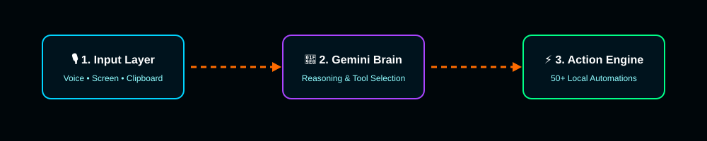
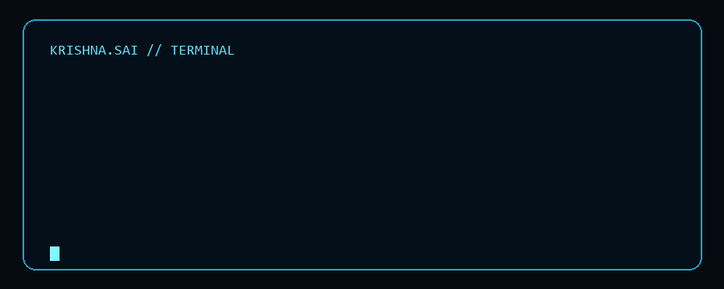

# Krishna Sai Channalli

**AI systems · agent engineering · automation**

Computer Science Engineer building intelligent systems across AI, agents, vision, voice, automation, and full-stack engineering.

### Engineering stack

### System domains

`AI agents` · `Intelligent applications` · `Computer vision` · `Voice systems` · `Automation` · `Developer infrastructure`

### Selected systems

**[VaultIQ AI](https://github.com/channallikrishnasai/vaultiq-ai)** — AI-powered personal finance for budgeting, investing, fraud protection, goals, and scenario planning. 
`Next.js 16` · `TypeScript` · `Prisma` · `Tailwind CSS` · multiple AI providers

**[LifeOS AI](https://github.com/channallikrishnasai/LifeOS-AI)** — life-management platform for projects, goals, habits, learning, and startup planning. 
`FastAPI` · `React` · `PostgreSQL` · `Redis` · `WebSockets` · specialized AI agents

**[PRISM / Entire Graph](https://github.com/channallikrishnasai/PRISM)** — coding-agent plugin for local repository maps, ranked code search, and change-impact navigation. 
`Go` · `tree-sitter` · local indexing · CLI plugin architecture

### Flagship — The-Opero

**[The-Opero](https://github.com/channallikrishnasai/The-Opero)** is an Open Personal Execution &amp; Response Operator: a local desktop AI operator with Python, PyQt6, Gemini integration, local execution modules, dashboard, plugins, and a WhatsApp bridge.

### Now building

**The-Opero** — local desktop AI execution and response automation.

**[GitHub](https://github.com/channallikrishnasai)** · **[LinkedIn](https://www.linkedin.com/in/krishna-sai-channalli-4528262b3)**

